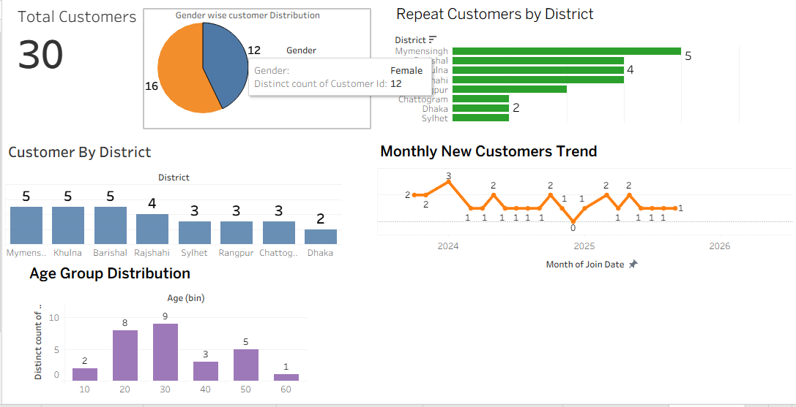

<<<<<<< HEAD
# Bangladesh E-Commerce Insights Dashboard

## Project Overview
This project analyzes data from a Bangladesh-based e-commerce business.  
Data includes orders, customers, and products.  
Tools used: **MySQL**, **Tableau** **Vs Code** 

## Project Goals
- Identify regions with highest sales  
- Find best-selling products  
- Analyze month-on-month growth  
- Calculate return rates  
- Understand repeat vs. new customers  

## Folder Structure
- `/data` → Original dataset CSV files  
- `/sql` → SQL query files  
- `/dashboard` → Tableau `.twbx` dashboard file  
- `/screenshots` → Screenshots of the dashboard visualizations  

## Key Insights
- Top 5 best-selling products  
- Monthly revenue trends  
- Return rates by product and overall  
- Repeat vs. new customer ratio  

## Screenshot Preview

## How to Run
1. Import the CSV files from `/data` into your SQL database (e.g., MySQL)  
2. Execute SQL queries in `/sql/main_analysis.sql` to perform data analysis  
3. Open Tableau dashboard file `/dashboard/ecommerce_dashboard_v1.twbx` to explore visualizations  

## Tools Used
- MySQL  
- Tableau  
- VS Code  

---

If you want me to share the datasets or SQL scripts, feel free to ask!

---

## License
MIT License  
GitHub: https://github.com/mannan613
=======
# bangladesh-ecommerce-insights-dashboard
>>>>>>> af43a663cda29bcd253eca24f9f8f83bb1f8ead5
